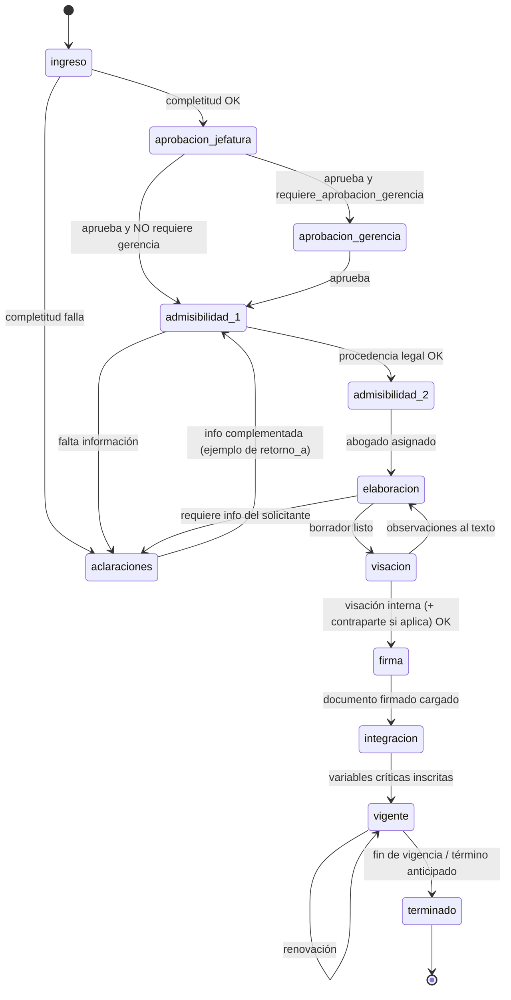
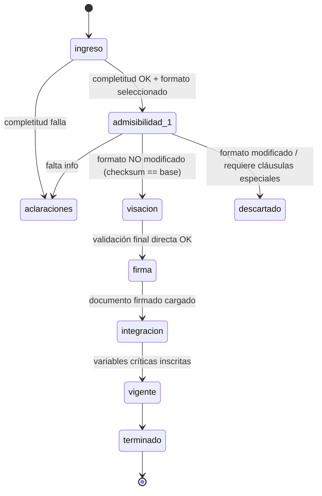
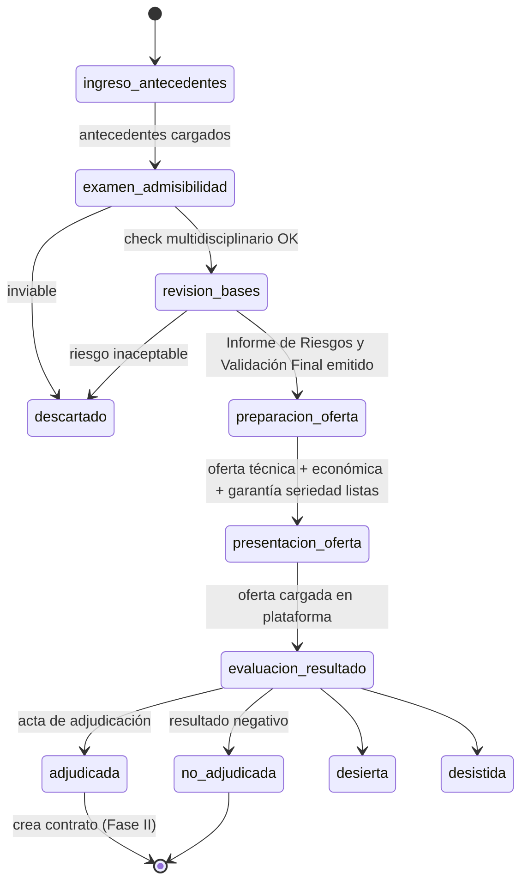
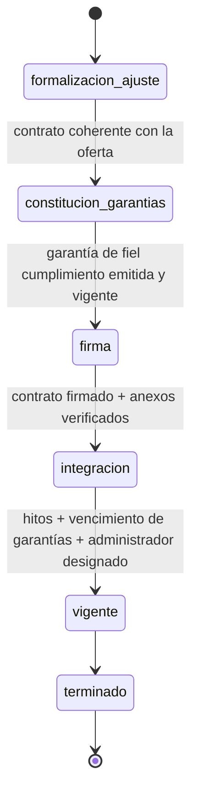

# 02 — Máquina de estados y transiciones

Contexto: [`../CLAUDE.md`](../CLAUDE.md) · Datos: [`01-diccionario-de-datos.md`](01-diccionario-de-datos.md)

Reglas generales:
- Cada transición **registra un `evento_estado`** (inmutable) con usuario, rol, fecha y comentario.
- Estados **terminales**: `terminado`, `descartado` (contratos); `no_adjudicada`, `desierta`,
  `desistida`, `descartado` (licitaciones). No admiten salida.
- **`descartado`** es alcanzable desde **cualquier** estado no terminal, por el área
  responsable del estado actual; exige `motivo_descarte`.
- **`aclaraciones`** guarda en `retorno_a` el estado desde el que se entró; al resolverse
  vuelve exactamente a ese estado.
- Una transición se rechaza si no cumple su **precondición**.

---

## 1. Enum `estado_contrato`

`ingreso` · `aprobacion_jefatura` · `aprobacion_gerencia` · `admisibilidad_1` ·
`admisibilidad_2` · `elaboracion` · `visacion` · `firma` · `integracion` · `vigente` ·
`terminado` · `aclaraciones` *(transversal)* · `descartado` *(transversal, terminal)* ·
`formalizacion_ajuste` *(Línea C, Fase II)* · `constitucion_garantias` *(Línea C, Fase II)*

---

## 2. Línea A — Flujo Regular / Abastecimiento

### Tabla de transiciones — Línea A

| # | Desde | Hacia | Rol autorizado | Precondición | Efecto |
|---|---|---|---|---|---|
| A1 | — | `ingreso` | `unidad_solicitante` | formulario completo + antecedentes adjuntos | crea `contrato`; validación automática de completitud |
| A2 | `ingreso` | `aprobacion_jefatura` | sistema | completitud OK | notifica a la jefatura de la unidad |
| A3 | `ingreso` | `aclaraciones` | sistema | completitud falla | `retorno_a = ingreso` |
| A4 | `aprobacion_jefatura` | `aprobacion_gerencia` | `jefatura` | aprueba **y** `requiere_aprobacion_gerencia = true` | |
| A5 | `aprobacion_jefatura` | `admisibilidad_1` | `jefatura` | aprueba **y** no requiere gerencia | deriva a Área Legal |
| A6 | `aprobacion_gerencia` | `admisibilidad_1` | `gerencia` | aprueba | deriva a Área Legal |
| A7 | `admisibilidad_1` | `admisibilidad_2` | `legal` | antecedentes completos y procedencia legal OK | |
| A8 | `admisibilidad_1` | `aclaraciones` | `legal` | falta información | `retorno_a = admisibilidad_1` |
| A9 | `admisibilidad_2` | `elaboracion` | `legal` | `abogado_id` asignado | |
| A10 | `elaboracion` | `visacion` | `legal` (abogado) | documento `tipo=borrador` cargado | |
| A11 | `elaboracion` | `aclaraciones` | `legal` | requiere info del solicitante | `retorno_a = elaboracion` |
| A12 | `visacion` | `firma` | `legal` + `unidad_solicitante` | visación interna OK; si hay tercero externo, Visación con Contraparte OK | |
| A13 | `visacion` | `elaboracion` | `legal` | observaciones al texto | |
| A14 | `firma` | `integracion` | `legal` | documento `tipo=contrato_firmado` cargado | |
| A15 | `integracion` | `vigente` | `admin_contratos` | `administrador_id` definido **y** (`fecha_fin_vigencia` definida **o** `vigencia_indefinida = true`) **y** garantías/hitos inscritos | activa control de cumplimiento |
| A16 | `vigente` | `vigente` | `admin_contratos` | renovación acordada | actualiza `fecha_fin_vigencia`; crea `hito tipo=renovacion` |
| A17 | `vigente` | `terminado` | `admin_contratos` | fin de vigencia o término anticipado | fija `fecha_cierre` |
| A18 | `aclaraciones` | *(valor de `retorno_a`)* | `unidad_solicitante` | información complementada | vuelve al estado guardado |
| A19 | *(cualquiera no terminal)* | `descartado` | área responsable del estado actual | `motivo_descarte` informado | terminal; `fecha_cierre` = hoy |

---

## 3. Línea B — Flujo Express / Autogestionado

Ruta: **`ingreso` → `admisibilidad_1` → `visacion` → `firma` → `integracion` → `vigente` → `terminado`.**
No pasa por `aprobacion_jefatura`, `aprobacion_gerencia`, `admisibilidad_2` ni `elaboracion`
(salvo que el monto supere el umbral de Gerencia → ver B-excepción).

### Tabla de transiciones — Línea B

| # | Desde | Hacia | Rol | Precondición | Efecto |
|---|---|---|---|---|---|
| B1 | — | `ingreso` | `unidad_solicitante` | `formato_id` seleccionado (formato `vigente`) + campos variables completos | crea `contrato` línea B |
| B2 | `ingreso` | `admisibilidad_1` | sistema | completitud OK | |
| B3 | `ingreso` | `aclaraciones` | sistema | completitud falla | `retorno_a = ingreso` |
| B4 | `admisibilidad_1` | `visacion` | `legal` | `hash_sha256` del documento **==** `formato_estandar.checksum_base` (clausulado inalterado) y sin cláusulas especiales | |
| B5 | `admisibilidad_1` | `aclaraciones` | `legal` | falta información | `retorno_a = admisibilidad_1` |
| B6 | `admisibilidad_1` | `descartado` | `legal` | el formato fue modificado o se requieren cláusulas especiales | recomendación: reingresar por Línea A |
| B7 | `visacion` | `firma` | `legal` (+ `unidad_solicitante`) | validación final directa OK | |
| B8 | `firma` | `integracion` | `legal` | documento `tipo=contrato_firmado` cargado | |
| B9 | `integracion` | `vigente` | `admin_contratos` | igual que A15 | |
| B10 | `vigente` | `vigente` / `terminado` | `admin_contratos` | igual que A16 / A17 | |
| B11 | `aclaraciones` | *(valor de `retorno_a`)* | `unidad_solicitante` | info complementada | |
| B12 | *(cualquiera no terminal)* | `descartado` | área responsable | `motivo_descarte` | terminal |

**B-excepción (monto alto):** si `requiere_aprobacion_gerencia = true`, se intercala
`ingreso → aprobacion_gerencia → admisibilidad_1`. Todo lo demás igual.

---

## 4. Línea C — Licitaciones

Se maneja en **dos entidades**:
- **Fase I (Pre-Adjudicación)** vive en `licitacion.estado` (`estado_licitacion`).
- Al **adjudicar**, el sistema crea un `contrato` (línea `C_licitacion`) que entra en
  **Fase II (Formalización)** en `estado_contrato`, partiendo de `formalizacion_ajuste`.

> **Decisión (resuelta en Etapa 1):** la Fase II usa **estados propios** en el enum
> `estado_contrato`: `formalizacion_ajuste` (Gate 1) y `constitucion_garantias` (Gate 2).
> Gate 3 → `firma`, Gate 4 → `integracion`, inicio de ejecución → `vigente`. El resto del
> ciclo (`terminado`, `descartado`) es común a las tres líneas.

### 4.1 Fase I — `estado_licitacion`

| # | Desde | Hacia | Rol | Precondición | Efecto |
|---|---|---|---|---|---|
| C1 | — | `ingreso_antecedentes` | `admin_licitaciones` | documento `tipo=bases` registrado | crea `licitacion`, `fase=pre_adjudicacion` |
| C2 | `ingreso_antecedentes` | `examen_admisibilidad` | `admin_licitaciones` | antecedentes cargados | convoca a Técnica/Financiera/Legal/Gerencia |
| C3 | `examen_admisibilidad` | `revision_bases` | `tecnica` + `financiera` + `legal` + `gerencia` | inhabilidades, factibilidad, plazos y garantías verificados | |
| C4 | `examen_admisibilidad` | `descartado` | `gerencia` | proyecto inviable | `motivo_descarte` |
| C5 | `revision_bases` | `preparacion_oferta` | `legal` + `tecnica` | `informe_riesgos_id` cargado (Validación Final) | |
| C6 | `revision_bases` | `descartado` | `legal` / `gerencia` | riesgo inaceptable | |
| C7 | `preparacion_oferta` | `presentacion_oferta` | `tecnica` + `financiera` + `legal` | oferta técnica + propuesta económica + `garantia tipo=seriedad_oferta` (si las bases la exigen) | |
| C8 | `presentacion_oferta` | `evaluacion_resultado` | `admin_licitaciones` | oferta cargada formalmente en plataforma | |
| C9 | `evaluacion_resultado` | `adjudicada` | `admin_licitaciones` / `gerencia` | acta/resolución de adjudicación | `resultado=adjudicado`; crea `contrato` línea C; `fase=formalizacion` |
| C10 | `evaluacion_resultado` | `no_adjudicada` | `admin_licitaciones` | resultado negativo | `resultado=no_adjudicado`; exige `analisis_interno` (mejora continua) |
| C11 | `evaluacion_resultado` | `desierta` / `desistida` | `admin_licitaciones` | sin ofertas / desistimiento | terminal |
| C12 | *(cualquiera no terminal)* | `descartado` | área responsable | `motivo_descarte` | terminal |

### 4.2 Fase II — Formalización (contrato línea C)

| # | Gate | Desde | Hacia | Rol | Precondición |
|---|---|---|---|---|---|
| C13 | 1 | `adjudicada` (licitación) | `formalizacion_ajuste` | `legal` | contrato definitivo recibido/confeccionado (lo crea `adjudicar_licitacion`) |
| C14 | 1→2 | `formalizacion_ajuste` | `constitucion_garantias` | `legal` | coherencia total con la oferta (multas, plazos, reajustes validados) |
| C15 | 2→3 | `constitucion_garantias` | `firma` | `financiera` | `garantia tipo=fiel_cumplimiento`/`correcta_ejecucion` en estado `vigente` (**bloqueo estricto**) |
| C16 | 3→4 | `firma` | `integracion` | `legal` | documento `tipo=contrato_firmado` + anexos verificados |
| C17 | 4→ejecución | `integracion` | `vigente` | `admin_contratos` | hitos registrados, vencimientos de garantías cargados, `administrador_id` designado |
| C18 | — | `vigente` | `terminado` | `admin_contratos` | fin de vigencia / término anticipado |
| C19 | — | *(cualquiera no terminal)* | `descartado` | área responsable | `motivo_descarte` |

---

## 5. Invariantes (validaciones que el motor debe garantizar siempre)

1. Toda transición genera exactamente un `evento_estado`; nunca se modifica el estado
   sin registro.
2. No se entra a `firma` si `requiere_garantia = true` (o línea C) y no existe una
   `garantia` de cumplimiento en estado `vigente`.
3. No se pasa `integracion → vigente` sin `administrador_id` y vigencia definida
   (fecha fin o indefinida).
4. `admisibilidad_2 → elaboracion` exige `abogado_id`.
5. Línea B: `admisibilidad_1 → visacion` exige `checksum` del documento igual al del
   `formato_estandar`. Cualquier diferencia obliga a `aclaraciones` o `descartado`.
6. `aclaraciones` siempre tiene `retorno_a`; al salir, el destino **debe** ser ese valor.
7. `descartado` y `terminado` no tienen transiciones de salida.
8. `monto >= parametro.monto_aprobacion_gerencia_clp` ⇒ `requiere_aprobacion_gerencia = true`
   y el flujo incluye el paso de Gerencia.
9. Solo un `formato_estandar` `vigente = true` por `nombre`.
10. Los recálculos diarios (`por_vencer`, `vencida`, `atrasado`, `solicitud_estancada`)
    no son transiciones de negocio: no generan `evento_estado`.
